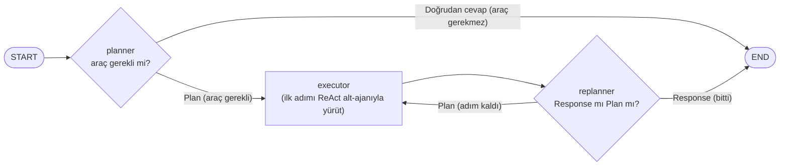

# Plan-and-Execute vs ReAct — Performans Analizi

İki LLM ajan mimarisini — **Plan-and-Execute** ve **ReAct** — **aynı sorular**,
**aynı model**, **aynı araçlar** ve **aynı çıktı şeması** üzerinde karşılaştıran bir
staj projesi. Amaç: iki yaklaşımı adil koşullarda çalıştırıp **başarı**,
**LLM çağrı sayısı**, **token tüketimi**, **süre**, **araç çağrısı** ve
**adım sayısı** üzerinden kıyaslamak.

> **Durum:** Plan-and-Execute mimarisi ReAct tarafıyla **hizalandı**: `tools.py`
> birebir ortak finans araç seti, aynı model/sağlayıcı (HF Router), aynı
> **equity-research** görev seti (HF `sccaglayanworkacc/equity-research-agentic-eval`,
> **55 soru**) ve aynı çıktı şeması (`test/a.json` — RunResult v2.0.0). İki projenin
> sonuç JSON'ları doğrudan karşılaştırılabilir.

Bu depo Plan-Execute tarafıdır. ReAct tarafı komşu `Staj_react_scratch` projesindedir.

---

## Mimariler

### Plan-and-Execute (bu depo)



> Kısa süreli bellek: `PlanExecuteAgent.run(question, thread_id=...)` verildiğinde
> son 5 (soru, cevap) çifti planner'a bağlam önsözü olarak eklenir; `thread_id`
> yoksa (eval kipi) görev metni değişmez. `reset_memory(thread_id)` ile silinir.

| Düğüm | Görevi |
|-------|--------|
| **planner** | Önce **triyaj** yapar: görev araç/güncel veri gerektiriyorsa bir adım listesi (`steps`) üretir; gerektirmiyorsa (kapsam dışı istek, selamlama, netleştirme) `direct_answer` ile **doğrudan cevap** verir ve graf biter. |
| **executor** | Plandaki **ilk** adımı bir `create_react_agent` alt-ajanıyla yürütür; araçları burada kullanır. |
| **replanner** | Tamamlanan adımlara/sonuçlara bakar; planı günceller veya nihai cevabı döndürür. |

Karar mantığı: `planner` **doğrudan cevap** verirse graf hemen **biter** (executor/
replanner hiç çalışmaz — araç gerektirmeyen sorularda tek LLM çağrısı). Aksi halde
plan yürütülür; `replanner` bir `Response` üretirse graf biter, bir `Plan` üretirse
kalan adımlar için `executor`'a geri dönülür.

### ReAct (karşılaştırma tarafı — `Staj_react_scratch`)

Her adımda *düşün → araç çağır → gözlemle* döngüsü kuran, elle yazılmış bir ReAct
ajanı. **Aynı** modeli ve **aynı** araç setini (`tools.py` birebir ortak) kullanır;
böylece tek değişken mimaridir.

---

## Adil karşılaştırma için hizalama

| Konu | Ortak değer |
|------|-------------|
| **Model / sağlayıcı** | İki tarafta da **aynı** model + endpoint (`.env` ile seçilir), `temperature=0`, `max_tokens=4096`. Kıyas koşuları OpenAI ve HF Router/Qwen ile ayrı ayrı yapıldı; bulgular her ikisinde de aynı yöndeydi (bkz. `rapor/RAPOR.md` §7). |
| **Araçlar** | `src/plan_execute/tools.py`, react_scratch'in `react_agent/tools.py`'siyle **byte-byte aynı** — 18 yfinance/web aracı. `get_tools()` bunları LangChain'e sarıp executor'a verir. |
| **Görev seti** | HF `sccaglayanworkacc/equity-research-agentic-eval` — **55 soru** (tier T1–T5 + Edge; dil EN 33 / TR 22) |
| **Metrikler** | success, status, steps/llm_calls, plan_steps, replan_count, tool_calls, tools_used, input/output/total_tokens, duration_ms, trace |
| **Çıktı şeması** | `test/a.json` — RunResult v2.0.0 (run → agents → steps → tool_calls/llm_calls); iki tarafta ortak |

**Araç seti (18):** `get_current_stock_price`, `get_historical_stock_prices`,
`get_stock_fundamentals`, `get_key_financial_ratios`, `get_income_statements`,
`get_quarterly_income_statements`, `get_balance_sheet`, `get_cash_flow`,
`get_analyst_recommendations`, `get_technical_indicators`, `get_company_info`,
`get_company_news`, `compare_stocks`, `resolve_ticker`, `web_search`, `plot_chart`,
`visualize_data`, `calculator`.

> **İki çizim aracı:** `plot_chart` hisse fiyat/gelir grafiği çizer (sembolden
> yfinance verisi çeker); `visualize_data` ise ELDEKİ ham sayısal veriyi (x/y listesi)
> çizer. İkisi de PNG kaydedip yolunu döner.

> **Ad farkı notu:** Dataset'in altın-anahtarları (`expected_tools`,
> `reference_trace`) `get_stock_price` ve `get_historical_prices` adlarını kullanır;
> `tools.py`'da bunların karşılığı sırasıyla `get_current_stock_price` ve
> `get_historical_stock_prices`'tır. Dataset'in `visualize_data`'sı ise **birebir aynı
> adla** mevcut — eşleme gerekmez. İki mimari de aynı `tools.py`'ı kullandığı için
> **karşılaştırma adil kalır**; yalnızca scorer dataset adlarına bakarsa bu iki eşleme
> akılda tutulmalı.

---

## Dizin yapısı

```
Staj_plan_execute/
├── main.py                      # birkaç örnek soruyla metrik özetli çalıştırıcı
├── pyproject.toml               # bağımlılıklar (uv)
├── src/plan_execute/
│   ├── config.py                # LLM fabrikası — HF Router (ReAct ile aynı)
│   ├── schemas.py               # Plan / Response / Act (structured output)
│   ├── state.py                 # PlanExecute — graf durumu (+ replan_count)
│   ├── prompts.py               # planner & replanner prompt'ları
│   ├── tools.py                 # ortak finans araçları (registry) + get_tools() köprüsü
│   ├── nodes.py                 # plan_step / execute_step / replan_step
│   ├── graph.py                 # StateGraph kurulumu
│   ├── agent.py                 # PlanExecuteAgent + MetricsCallback + RunResult (+ kısa süreli bellek)
│   ├── run_schema.py            # RunResult → a.json v2.0.0 (to_run_result_schema)
│   └── run.py                   # canlı stream CLI (adım adım izlemek için)
└── test/
    ├── a.json                   # RunResult v2.0.0 JSON şeması (react_scratch ile ortak)
    ├── test.py                  # HF dataset eval koşucusu → test/results/
    ├── results/                 # eval çıktıları (results_<etiket>.json + _schema.json)
    └── test_plan_execute_agent.py  # (eski KKB harness — artık kullanılmıyor)
```

---

## Kurulum (uv)

```powershell
# OneDrive altında hardlink desteklenmediği için copy modu gerekir:
$env:UV_LINK_MODE = "copy"
uv sync
# .env oluştur; içine EN AZ bir LLM API anahtarı (LLM_API_KEY / HF_TOKEN / OPENAI_API_KEY…)
# ve bir model adı (LLM_MODEL) yaz. Şablon için env.example'a bak.
```

---

## Ortam değişkenleri (.env)

> **Zorunlu iki şey var: bir LLM API anahtarı ve bir model adı.** Anahtar için
> `LLM_API_KEY` ya da eşdeğeri (`HF_TOKEN`, `OPENAI_API_KEY`, `AZURE_OPENAI_API_KEY`,
> `GOOGLE_API_KEY`… herhangi biri); model için `LLM_MODEL` (ya da eski adıyla
> `HF_MODEL`). İkisinden biri eksikse `get_llm()` açık bir hata verir — sessizce bir
> varsayılana düşmez. Geri kalanı **opsiyoneldir**. Sağlayıcı seçimi için alttaki
> **"Farklı LLM sağlayıcısı"** bölümüne bak.

| Değişken | Zorunlu? | Açıklama |
|----------|:--------:|----------|
| `LLM_API_KEY` | **evet** (ya da eşdeğeri) | Sağlayıcının anahtarı. `HF_TOKEN`, `OPENAI_API_KEY`, `AZURE_OPENAI_API_KEY`, `GOOGLE_API_KEY`, `ANTHROPIC_API_KEY`, `GROQ_API_KEY` de kabul edilir (ilk dolu olan kullanılır). |
| `LLM_MODEL` | **evet** | Model adı (ör. `gpt-4o-mini`, `Qwen/Qwen3.5-122B-A10B:deepinfra`). `HF_MODEL` de okunur. Varsayılanı **yoktur**. |
| `LLM_BASE_URL` | opsiyonel | Sağlayıcının OpenAI-uyumlu endpoint'i. `HF_BASE_URL` de okunur. Boş bırakılırsa OpenAI'ye (`api.openai.com`) gider. |
| `LLM_TIMEOUT` / `LLM_MAX_RETRIES` | opsiyonel | Tek LLM çağrısı zaman aşımı (sn) ve yeniden deneme (varsayılan 90 / 2). Sağlayıcı askıya alırsa koşu bloklanmasın diye. |
| `TAVILY_API_KEY` | opsiyonel | Yalnızca `web_search` aracı için. Yoksa o araç devre dışı kalır, sistem çalışmaya devam eder. |
| `TEMPERATURE` / `MAX_TOKENS` | opsiyonel | Örnekleme/yanıt sınırı (varsayılan 0.1 / 4096; eval `test.py` sıcaklığı 0'a zorlar). |
| `RECURSION_LIMIT` | opsiyonel | Graf özyineleme güvenlik sınırı (varsayılan 50). |

### Farklı LLM sağlayıcısı (sağlayıcı-bağımsız)

Sistem herhangi bir sağlayıcının anahtarıyla çalışır. Çoğu sağlayıcı **OpenAI-uyumlu**
bir endpoint sunduğu için genelde üç değişken yeter; bunlar ayarlanırsa eski `HF_*`
adlarının yerine geçer:

| Değişken | Açıklama |
|----------|----------|
| `LLM_API_KEY` | Sağlayıcının API anahtarı. |
| `LLM_MODEL` | Model adı (ör. `gpt-4o-mini`, `gemini-2.5-flash`, `llama-3.3-70b-versatile`). |
| `LLM_BASE_URL` | Sağlayıcının OpenAI-uyumlu endpoint'i. |
| `LLM_PROVIDER` | (Opsiyonel) `openai` (varsayılan) yerine `google_genai`/`anthropic`/… → native entegrasyon (paketi kurulmalı). |
| `LLM_STRUCTURED_METHOD` | (Opsiyonel) Sağlayıcı `json_schema` desteklemiyorsa `function_calling` veya `json_mode`. |

> **HF Router / Qwen gotcha'sı:** HF Router `Qwen/Qwen3.5-122B-A10B`'yi novita **ve**
> deepinfra'ya dağıtır; novita structured output'u desteklemez → 400. Model adına
> `:deepinfra` son ekini ekleyerek sağlayıcıyı sabitle
> (`LLM_MODEL=Qwen/Qwen3.5-122B-A10B:deepinfra`) — planner/replanner structured output
> kullandığı için bu şart.

Örnek base_url'ler: OpenAI `https://api.openai.com/v1` · Gemini
`https://generativelanguage.googleapis.com/v1beta/openai/` · Groq
`https://api.groq.com/openai/v1` · OpenRouter `https://openrouter.ai/api/v1` ·
yerel Ollama `http://localhost:11434/v1`.

**Azure OpenAI** (deployment + api-version + `api-key` header ile OpenAI'den ayrı):
```env
LLM_PROVIDER=azure_openai
AZURE_OPENAI_ENDPOINT=https://<kaynak-adin>.openai.azure.com
AZURE_OPENAI_API_KEY=<key>
OPENAI_API_VERSION=2024-10-21
AZURE_OPENAI_DEPLOYMENT=<deployment-adin>   # Azure'da model değil, DEPLOYMENT adı
```

> Sistem structured output (planner/replanner) + tool-calling (executor) kullanır;
> seçtiğin model ikisini de desteklemeli. **Benchmark kıyası** için iki tarafı da
> (plan-execute + react_scratch) **aynı** modele almayı unutma.

---

## Çalıştırma

```powershell
$env:UV_LINK_MODE = "copy"

# main.py — birkaç örnek soruyla metrik özeti (hızlı duman testi)
uv run python main.py
uv run python main.py "What is the current share price of Apple?"

# Grafiği adım adım izlemek için (metrik yok, sadece akış)
uv run python -m plan_execute.run "What is the current analyst consensus for Alphabet?"

# EVAL — HF dataset'inin sorularını koşar, a.json'a uygun çıktı üretir
uv run python test/test.py --version pe-v1            # 55 sorunun tümü
uv run python test/test.py --limit 5 --validate       # ilk 5 + şema doğrula
uv run python test/test.py --index 0 3 7              # sadece bu index'ler
uv run python test/test.py --list                     # soruları listele, çalıştırma
```

Eval çıktıları `test/results/` altına yazılır:
`results_<etiket>.json` (okunası özet + her soru için metrik/trace),
`results_<etiket>_schema.json` (a.json v2.0.0'a uygun RunResult dizisi) ve
`progress_<etiket>.jsonl` (canlı olay akışı). Bu şema ReAct'in `test/results/`
çıktısıyla **aynıdır**, yani iki tarafı yan yana koyup karşılaştırabilirsin.
`--validate` çıktıyı `test/a.json` ile jsonschema üzerinden doğrular.

---

## Sohbet arayüzü (app.py)

Ajanı tarayıcıdan interaktif denemek için basit bir sohbet arayüzü:

```powershell
$env:UV_LINK_MODE = "copy"
uv run python app.py          # → http://127.0.0.1:8000   (PORT / HOST env ile değişir)
```

- **FastAPI** (`app.py`) kök dizindeki `index.html` React arayüzünü sunar; `/api/chat`
  ajanı çalıştırır, `/api/reset` belleği siler.
- **Kısa süreli bellek:** aynı sohbette (thread) önceki turlar hatırlanır — son 5
  (soru, cevap) çifti planner'a bağlam olarak eklenir; **🗑 Temizle** ile sıfırlanır
  (`PlanExecuteAgent._memory`, thread_id bazlı). Eval kipinde (thread_id yok) devre dışı.
- Cevabın altında **"adımları göster"** ile plan + araç çağrılarının ayrıntısı görünür
  (test live-log'uyla aynı format).

### Oturum log'ları

Her sohbet (thread) **kendi log dosyasına** yazar: `logs/<thread_id>.log`
(dizin `LOG_DIR` ile değişir). Terminalde yalnızca kısa özet kalır; adım adım tam
akış dosyaya iner — paralel sohbetler birbirine karışmaz ve koşu bittikten sonra da
incelenebilir. Dosya canlı güncellenir, `tail -f` ile izlenebilir.

Log grafiğin akışını olduğu gibi gösterir: planner'ın **ürettiği plan**, executor'ın
o an **yürüttüğü adım** + sonucu, replanner'ın **"devam mı bitir mi"** kararı, her LLM
turunun ham çıktısı (`💭` — planner/replanner'da structured output JSON'ı, executor'da
düz akıl yürütme) ve her araç çağrısı (girdi/çıktı/süre).

```
🧠 PLANNER ✓ PLAN üretildi — 2 adım (6.0sn):
      1. Apple hissesinin sembolünü belirle (resolve_ticker).
      2. Apple hissesinin güncel fiyatını getir (get_current_stock_price).
⚙️  EXECUTOR ▶ adım yürütülüyor (planda 2 adım kaldı):
      → Apple hissesinin sembolünü belirle (resolve_ticker).
      · [executor] LLM turu (1.0sn, +16 tok)
      · resolve_ticker(Apple) ✅ 7563ms
           → 'Apple' için bulunan semboller: AAPL — Apple Inc. (NMS) …
⚙️  EXECUTOR ✓ adım tamamlandı (10.2sn)
🔁 REPLANNER ✓ karar: DEVAM — plan revize edildi — 1 adım (1.0sn):
      1. Apple hissesinin güncel fiyatını getir (get_current_stock_price).
```

> Düğüm olayları (planner/executor/replanner sınırları) `MetricsCallback`'in canlı
> kancasından gelir; **metriklere ve `a.json` çıktısına karışmaz** — yani ReAct
> kıyasının ortak şeması bu log'dan etkilenmez.

---

## Toplanan metrikler

| Metrik | Anlamı |
|--------|--------|
| `success` / `status` | Nihai cevaba ulaşıldı mı; `success` / `partial` / `error` |
| `steps` / `llm_calls` | Toplam LLM çağrısı (planner + executor turları + replan). ReAct'in `steps`'iyle aynı tanım: bir LLM invoke. |
| `plan_steps` | (Plan-Execute'a özgü) Yürütülen plan adımı sayısı |
| `replan_count` | (Plan-Execute'a özgü) Planın gerçekten revize edildiği (replanner'ın nihai cevap yerine yeni plan döndürdüğü) sayı — başarılı görevde `plan_steps − 1` |
| `tool_calls` / `tools_used` | Araç çağrı sayısı ve hangi araçların kullanıldığı |
| `input/output/total_tokens` | Token tüketimi (maliyet göstergesi) |
| `duration_ms` | Görev süresi |
| `trace` | Yürütülen (plan adımı, executor sonucu) çiftleri |

> Metrikler grafiğe eklenen bir LangChain callback (`MetricsCallback`) ile **tüm**
> grafiği (executor'ın alt-ajanı dâhil) kapsayacak şekilde toplanır; her LLM/araç
> çağrısı süre + token + zaman damgasıyla kaydedilir ve `run_schema.py` bunları
> a.json adımlarına (planning / tool_call / synthesis) çevirir.

---

## Sıradaki adımlar

- [ ] 55 sorunun tümünü koşup her iki mimarinin `_schema.json` çıktısını üretmek
- [ ] İki tarafın JSON'larını okuyup karşılaştırma tablosu/grafik üreten rapor betiği
- [ ] Dataset'in `reference_*` / `judge_hints` altın-anahtarlarını kullanan bir scorer

---

## Kaynaklar

- Wang et al., *Plan-and-Solve Prompting* (2023)
- Yao et al., *ReAct: Synergizing Reasoning and Acting in Language Models* (2022)
- [LangGraph — Plan-and-Execute rehberi](https://langchain-ai.github.io/langgraph/tutorials/plan-and-execute/plan-and-execute/)
- [Dataset — sccaglayanworkacc/equity-research-agentic-eval](https://huggingface.co/datasets/sccaglayanworkacc/equity-research-agentic-eval)
```
