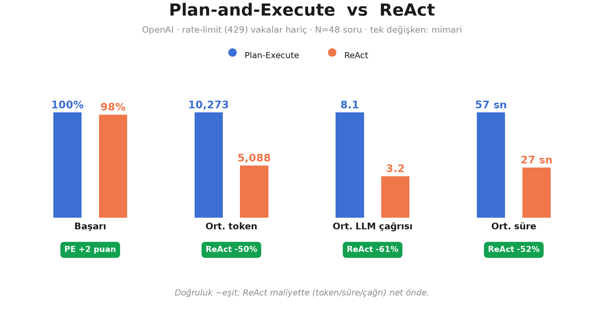
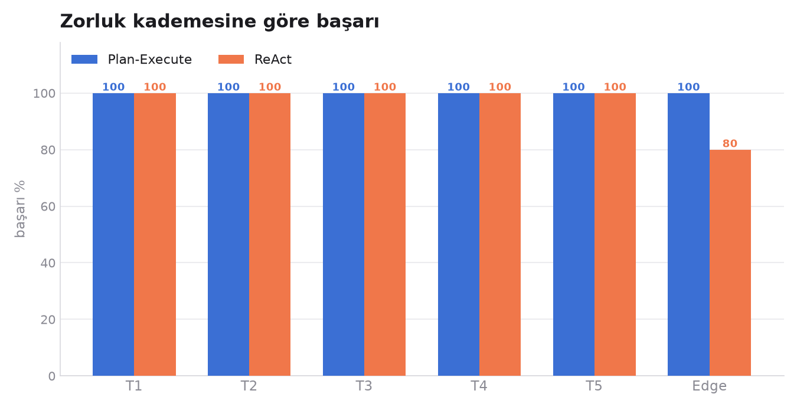
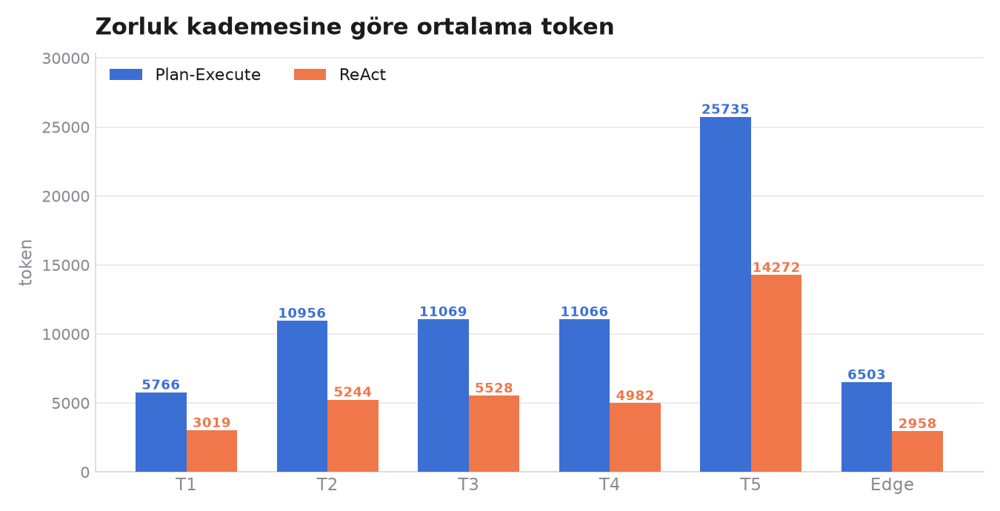
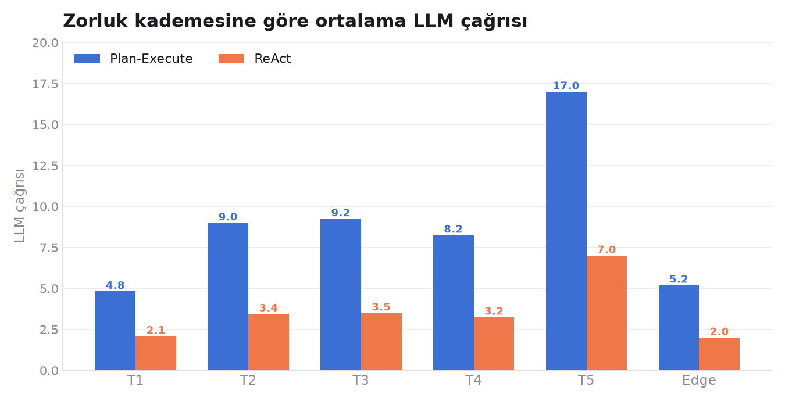
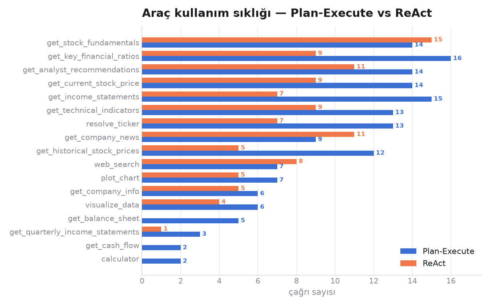
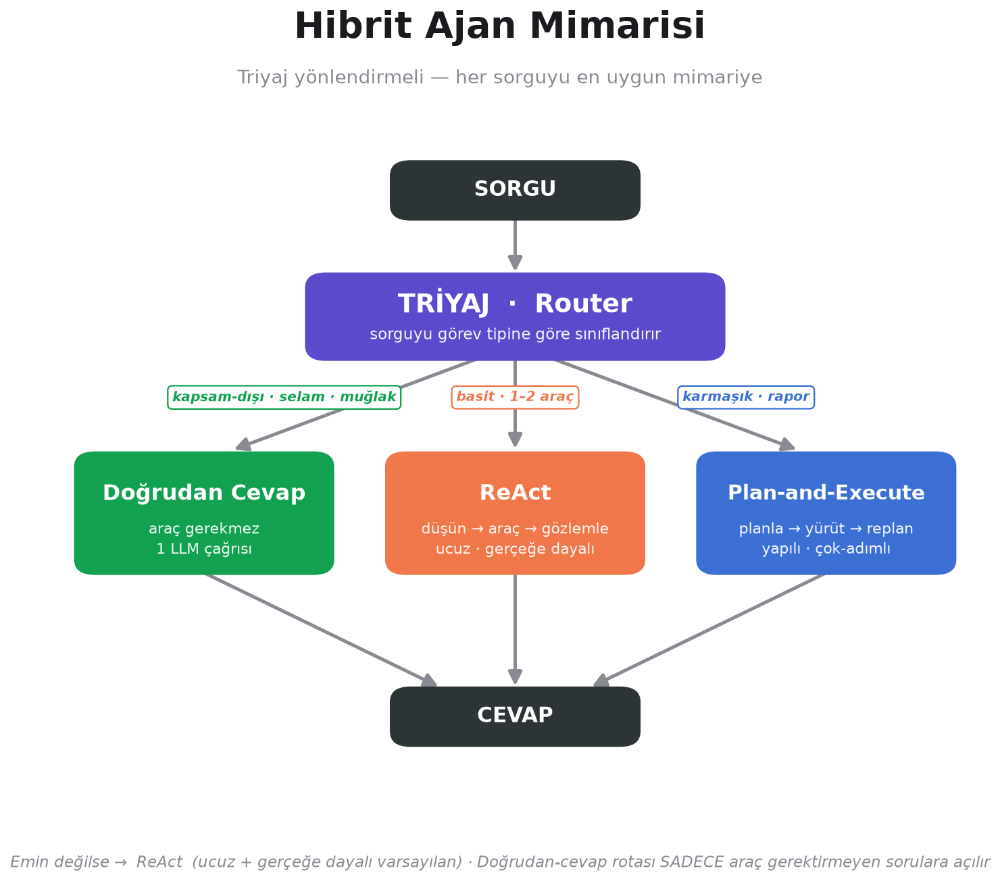

# Plan-and-Execute vs ReAct — Genel Gözlemler

**Deney:** Aynı model (OpenAI), aynı 18 araç (`tools.py` iki projede birebir aynı), aynı 55
soru (HF `equity-research-agentic-eval`), aynı çıktı şeması (`test/a.json` v2.0.0).
**Tek değişken: mimari.**

> **Ana bulgu:** Doğruluk **~eşit**; ReAct aynı işi **~yarı maliyetle** yapıyor
> (%50 daha az token, %61 daha az LLM çağrısı, %52 daha kısa süre).
> Plan-Execute'un ek planlama katmanı bu görev setinde doğruluğa katkı sağlamıyor.

---

## 1) Genel karşılaştırma

| Metrik | Plan-Execute | ReAct | Fark |
|--------|-------------:|------:|-----:|
| Başarı | %100 (48/48) | %98 (47/48) | ~eşit |
| Ort. token | 10.273 | 5.088 | ReAct **−50 %** |
| Ort. LLM çağrısı | 8.1 | 3.2 | ReAct **−61 %** |
| Ort. süre | 56.7 sn | 27.0 sn | ReAct **−52 %** |

> **Not (önemli):** Ham koşuda başarısızlıkların çoğu **OpenAI rate-limit (429)** kaynaklıydı
> (org'un 30.000 TPM limiti), mimari değil. Adil kıyas için iki tarafta da 429 alan **7 vaka
> çıkarıldı** (2.8, 5.3–5.7, E.6) → tüm sayılar kalan **N=48** ortak vaka üzerinden.
> ReAct'in tek kalan hatası (E.3) `visualize_data` aracındaki bir bug'dı — **düzeltildi**.

---

## 2) Kademeye göre

429 gürültüsü çıkınca başarı iki tarafta da neredeyse tam. Daha önce görülen
"Plan-Execute T5'te çöküyor" tablosu **gerçek değildi** — o vakalar kota duvarına
çarpmıştı, mimari başarısızlığı değildi.

Maliyet farkı **her kademede tutarlı**: Plan-Execute her seviyede ~2 kat token ve çağrı
harcıyor. Kaynağı net — planner + her adımdan sonra çalışan replanner.

---

## 3) Araç kullanımı

Plan-Execute neredeyse **her aracı daha çok** çağırıyor (ör. `get_key_financial_ratios`
16'ya 9). Yani fark sadece "düşünme"de değil; plan-execute aynı soruya daha fazla veri
toplayarak da maliyeti büyütüyor.

---

## 4) Kritik ders: "cevap üretti" ≠ "doğru cevap"

`success=True` yalnızca bir cevap döndüğünü gösterir. Cevapları tek tek okuyunca
**sistematik bir Plan-Execute zaafı** çıktı:

| Vaka | Plan-Execute | ReAct |
|------|--------------|-------|
| **1.11** "bar grafik çiz" | ❌ araç çağırmadı → grafik yerine **Python kodu** verdi | ✅ gerçek PNG |
| **3.3** "WMT gelir grafiği" | ❌ `visualize_data` atladı → **ASCII/metin** grafik | ✅ gerçek PNG |
| **3.4** "THY neden düştü?" | ❌ haber/web aramadı → **uydurma** ("...olabilir") | ✅ gerçek haberlere dayalı |
| **1.2** "Aselsan ne iş yapar" | ⚠️ araç yok → **modelin ezberinden** (doğrulanmamış) | ✅ `get_company_info` verisi |

**Kök neden:** Plan-Execute'un planner'ındaki **triyaj fazla ateşliyor** — olgusal ve
görselleştirme görevlerinde bile "araç gerekmez" deyip doğrudan cevaplıyor. Yani
naif metrikte eşit görünen doğruluk, **içerik kalitesinde ReAct lehine** ayrışıyor.

---

## 5) Öneri: triyaj yönlendirmeli hibrit

Bulgular "biri diğerini ezer" demiyor, **"hangisi iyi görev tipine bağlı"** diyor:
- **Basit / 1–2 araç** → ReAct (ucuz, gerçeğe dayalı)
- **Kapsam-dışı / selam / muğlak** → doğrudan cevap (tek çağrı)
- **Karmaşık / çok-adımlı rapor** → Plan-Execute (yapılı sentez)

**Kritik kural:** doğrudan-cevap rotası SADECE gerçekten araç gerektirmeyen sorulara
açılmalı — Plan-Execute'un düştüğü tuzak tam da buydu. Emin değilse → ReAct.

---

## 6) Sınırlar ve açık işler

- **Tek koşu.** Kesinlik için tekrarlı koşuların ortalaması gerekir.
- **Süre** sağlayıcı gecikmesine duyarlı; token ve LLM çağrısı mimariye bağlı olduğundan
  daha güvenilir göstergeler — ikisi de aynı yönü işaret ediyor.
- **Doğruluk henüz otomatik ölçülmüyor.** `test/score.py` (AQS — Agent Kalite Skoru)
  yazıldı: dataset'in altın-anahtarlarıyla 6 boyutu (içerik, araç seçimi, gerçeğe dayanma,
  görev tamamlama, halüsinasyon, dil) 0–100 skora çevirir. **Koşulması bekliyor** —
  çalıştırılınca "kim daha doğru" sorusu sayıyla cevaplanacak.
- **Model bağımlılığı:** Aynı deney Qwen ile yapıldığında da tablo benzerdi (ikisi de ~%98
  başarı, ReAct ~yarı maliyet) — bulgu tek modele özgü değil.
