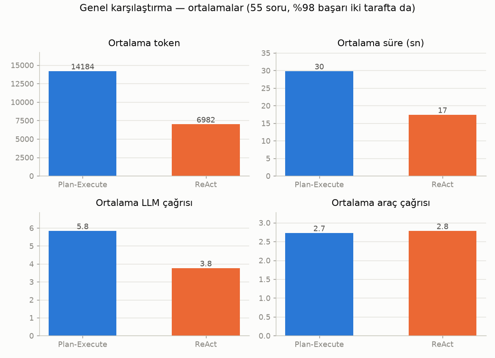
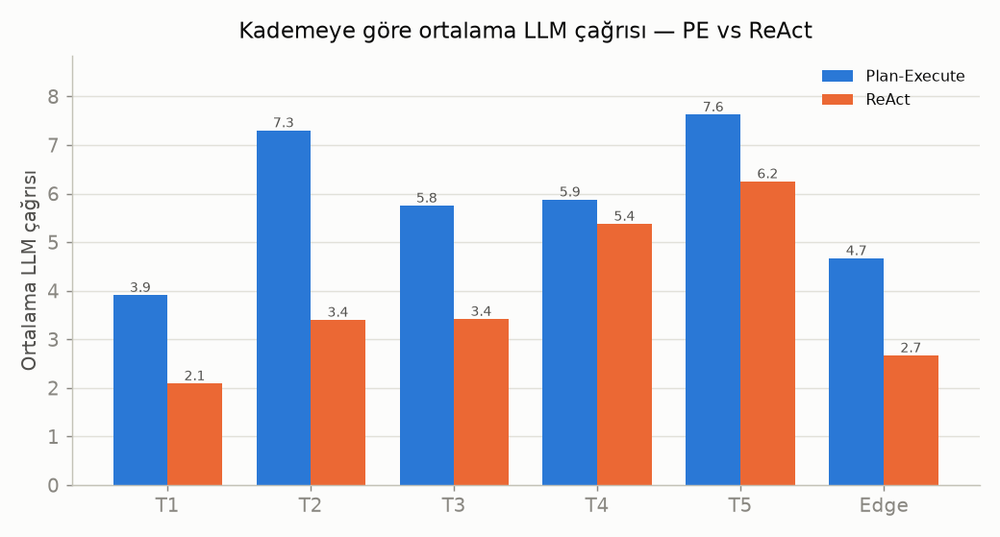
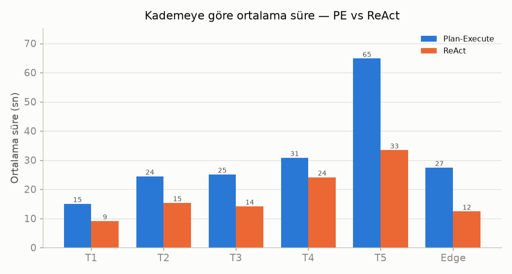

# Plan-and-Execute vs ReAct — Karşılaştırma

**Aynı model, aynı 18 araç, aynı 55 soru, aynı çıktı şeması — tek değişken: mimari.**
Plan-Execute koşusu `tes8`, ReAct koşusu `test3`; model Qwen/Qwen3.5-122B-A10B (HF Router / deepinfra).

> **Tek cümle:** İki mimari de **aynı doğruluğa** ulaştı (%98, her ikisinde de 54/55) ve **aynı sayıda araç** çağırdı — ama ReAct bunu **yarı token, ~%40 daha kısa sürede ve %36 daha az LLM çağrısıyla** yaptı. Bu veri setinde Plan-Execute'un planlama yükü doğruluğu artırmadan maliyeti ~2 katına çıkardı.

---

## Genel karşılaştırma

| Metrik | Plan-Execute | ReAct | Fark (ReAct) |
|--------|-------------:|------:|-------------:|
| Başarı | %98.2 (54/55) | %98.2 (54/55) | **eşit** |
| Ortalama araç çağrısı | 2.73 | 2.78 | ≈ eşit |
| Ortalama LLM çağrısı (steps) | 5.84 | 3.76 | **−36 %** |
| Ortalama token | 14.184 | 6.982 | **−51 %** |
| Ortalama süre | 29.8 sn | 17.4 sn | **−42 %** |

**Okunuşu:** Başarı ve araç çağrısı **eşit** (iki mimari de aynı işi yapıyor, aynı sayıda araç çağırıyor). Fark tamamen **akıl yürütme yükünde**: Plan-Execute'un planner + replanner katmanı, aynı sonucu üretmek için ~2 kat token ve LLM çağrısı harcıyor.

---

## Kademeye göre kırılım

### Token

### LLM çağrısı

### Süre

Fark **her zorluk kademesinde** tutarlı: Plan-Execute her seviyede daha fazla token/çağrı harcıyor; makas en çok karmaşık (T5) ve çok araçlı (T2) vakalarda açılıyor.

---

## Yorum — neden böyle?

- **Araç çağrısı eşit → "eylem" aynı.** İki mimari de aynı verileri çekiyor (2.7–2.8 araç/vaka). Yani fark *ne yaptıklarında* değil, *ne kadar düşündüklerinde*.
- **Plan-Execute'un yapısal yükü:** her görevde ayrı bir **planner** (tüm planı çıkar) + her adımdan sonra **replanner** (devam/bitir kararı) çalışıyor. Bu ekstra LLM turları token ve süreyi şişiriyor — ReAct ise tek döngüde "düşün-eyle" yaptığı için daha yalın.
- **Bu veri setinde doğruluk avantajı yok:** görevlerin çoğu 1–5 araçlık, doğrusal akışlar; Plan-Execute'un önden-planlama gücü burada başarıya yansımıyor, sadece maliyet ekliyor.
- **Plan-Execute'un potansiyel üstünlükleri** (bu görevlerde tetiklenmedi ama not edilmeli): çok daha uzun/dallı görevlerde plan tutarlılığı, triyaj bypass ile kapsam-dışı sorularda tek-çağrı, açık plan sayesinde izlenebilirlik/hata ayıklama.

---

## Sınırlar / dürüstlük notu

- **Tek koşu** (her mimariden birer kez). Kesin sonuç için tekrarlı koşuların ortalaması gerekir.
- **Süre, sağlayıcı gecikmesine duyarlı** (deepinfra saate göre değişiyor); token ve LLM çağrısı ise mimariye bağlı olduğundan daha güvenilir göstergeler — ve onlar da aynı yönü işaret ediyor.
- Her iki tarafta da **aynı tek vaka** (T5 / 5.1, Koç Holding kapsamlı rapor) zorlandı — mimariden çok görevin ağırlığına işaret ediyor.

---

## Sunum için ana mesaj

> **"Aynı doğruluk, yarı maliyet."** Bu benchmark'ta ReAct, Plan-and-Execute ile aynı başarıyı (%98) ve aynı araç kullanımını, **yaklaşık yarı token ve süreyle** elde etti. Plan-and-Execute'un ek planlama katmanı, bu tür orta-uzunlukta finans görevlerinde doğruluğu artırmadan hesap maliyetini iki katına çıkarıyor. Planlama yükünün karşılığını alabilmek için daha uzun, çok adımlı ve dallanan görevler gerekiyor.
