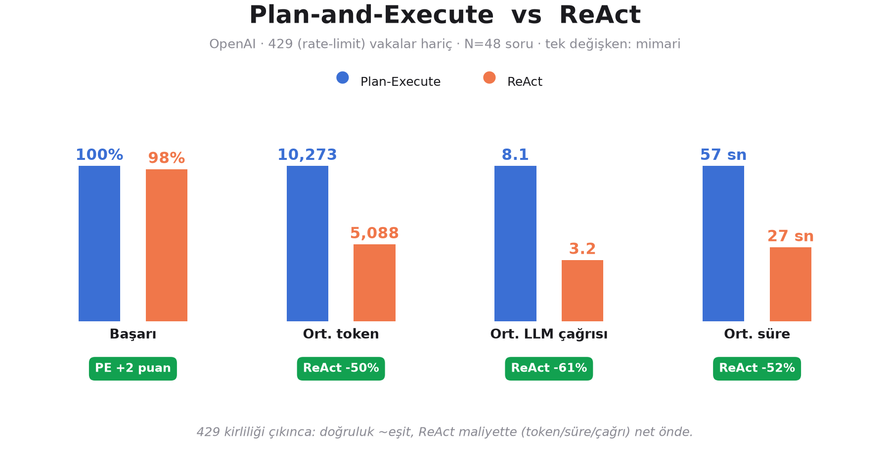
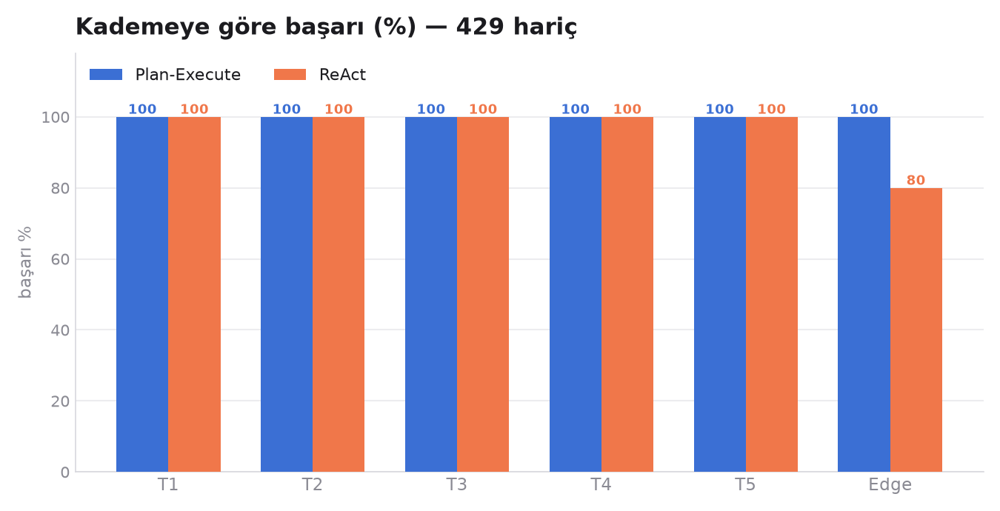
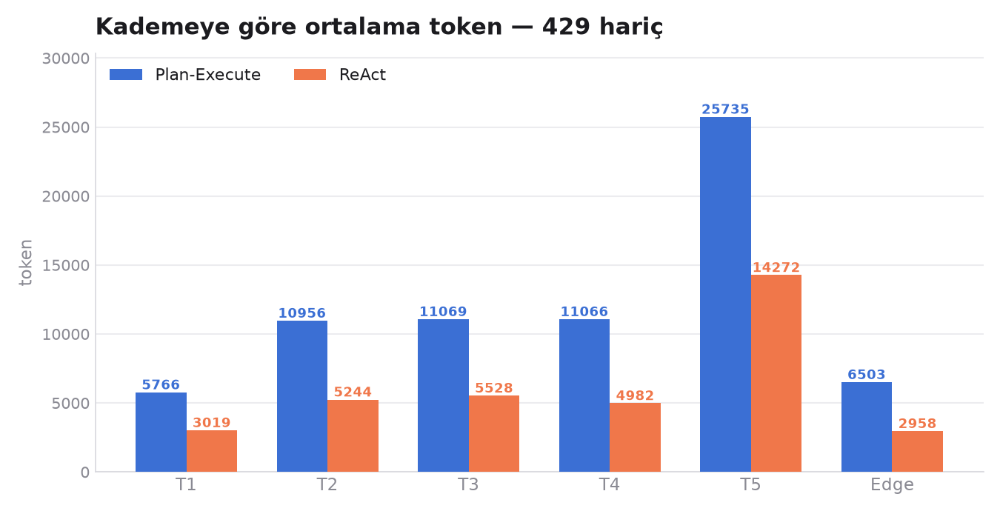
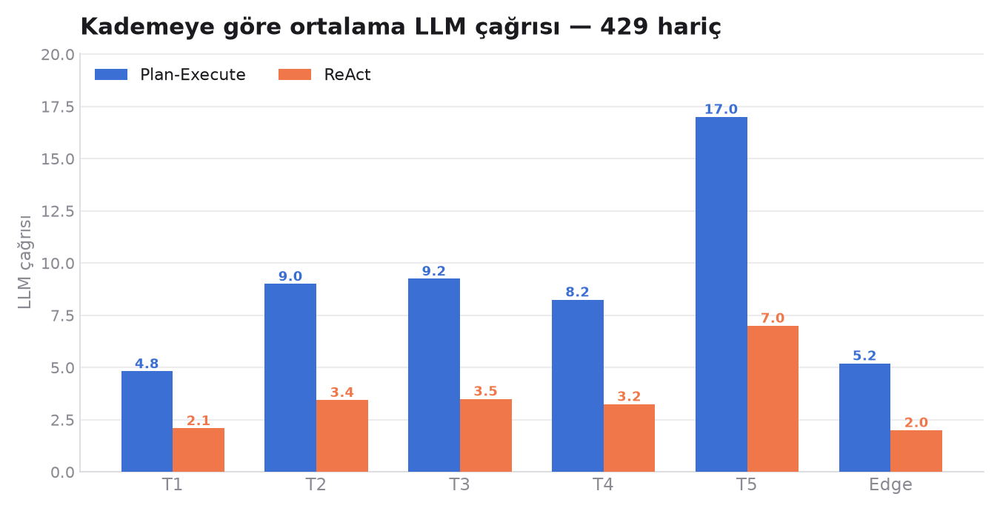

# Plan-and-Execute vs ReAct — Karşılaştırma (OpenAI, `test2`, 429 hariç)

**Aynı model (OpenAI), aynı 18 araç, aynı 55 soru, aynı çıktı şeması — tek değişken: mimari.**

> ⚠️ **Önemli düzeltme:** Ham `test2` koşusunda başarısızlıkların çoğu **OpenAI rate-limit (429)** kaynaklıydı (org'un 30.000 TPM limiti), mimari değil. Adil kıyas için **her iki tarafta da 429 alan 7 vaka çıkarıldı** (2.8, 5.3–5.7, E.6). Aşağıdaki tüm sayılar kalan **N=48** ortak vaka üzerinden.

> **Tek cümle:** 429 kirliliği temizlenince **doğruluk ~eşit** (PE %100, ReAct %98); ReAct'in gerçek avantajı **maliyette**: ~yarı token, ~yarı süre, %60 daha az LLM çağrısı.

---

## Genel (429 hariç, N=48)

| Metrik | Plan-Execute | ReAct | Fark |
|--------|-------------:|------:|-----:|
| Başarı | **%100 (48/48)** | %98 (47/48) | ~eşit (PE +2 puan) |
| Ort. token | 10.273 | 5.088 | ReAct **−50 %** |
| Ort. LLM çağrısı | 8.1 | 3.2 | ReAct **−61 %** |
| Ort. süre | 56.7 sn | 27.0 sn | ReAct **−52 %** |
| Ort. araç çağrısı | 3.3 | 2.2 | PE biraz fazla |

ReAct'in tek kalan başarısızlığı **E.3** → `visualize_data` aracında x/y uzunluk uyuşmazlığı bug'ı (429 değil, gerçek hata; düzeltilecek).

---

## Kademeye göre

429 çıkınca başarı iki tarafta da neredeyse tam; tek istisna ReAct'in E.3'teki araç hatası (Edge). "PE T5'te çöküyor" görüntüsü **tamamen rate-limit'ti** — o vakalar hariç bırakıldı.

Plan-Execute her kademede ~2 kat token ve çağrı harcıyor (planner + replanner yükü) — makas tutarlı.

---

## Yorum

- **Doğruluk ~eşit:** İki mimari de aynı sorulara aynı doğrulukta cevap veriyor (429 gürültüsü çıkınca). Bu, Qwen koşusundaki bulguyla (ikisi de %98) tutarlı.
- **ReAct maliyette net önde:** ~yarı token/süre, %60 daha az LLM çağrısı. Plan-Execute'un planlama katmanı bu görev setinde doğruluğu artırmadan maliyeti ikiye katlıyor.
- **Pratik yan etki:** PE'nin yüksek token kullanımı, sıkı bir dakika-limiti (TPM) altında **daha çok rate-limit yemesine** yol açar — ham koşuda PE'nin 6, ReAct'in 1 vaka 429 yemesinin sebebi bu. Yani verimlilik farkının operasyonel bir bedeli de var.

## Sınırlar / yapılacaklar
- Tek koşu; süre sağlayıcı gecikmesine duyarlı (token/çağrı daha güvenilir).
- **429'lar kalıcı çözülmeli:** ya OpenAI kademesini yükselt, ya da koşucuya rate-limit dayanıklılığı ekle (`Retry-After`'a saygı + uzun backoff / vakalar arası pacing) → sonra tam 55 vakalık temiz koşu.
- **`visualize_data` bug'ı** (x/y uzunluk kontrolü) düzeltilecek — iki projede de.

## Sunum mesajı
> **"Aynı doğruluk, yarı maliyet."** Rate-limit gürültüsü temizlenince iki mimari de aynı işi aynı doğrulukta yapıyor; ReAct bunu ~yarı token ve süreyle başarıyor. Plan-Execute'un ek planlama katmanı bu görev setinde doğruluğa katkı sağlamıyor, üstelik yüksek token kullanımı sıkı kotalar altında onu daha kırılgan yapıyor.
