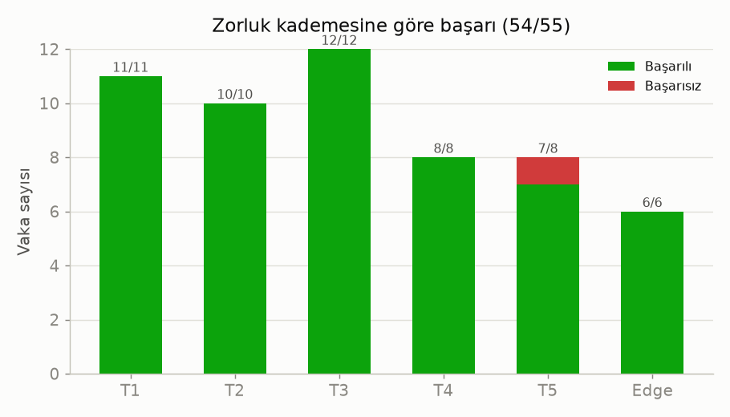
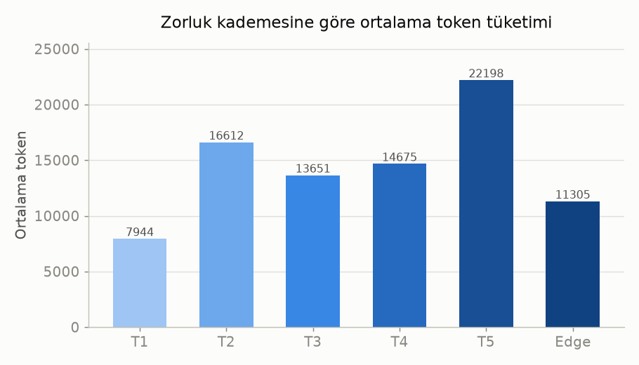
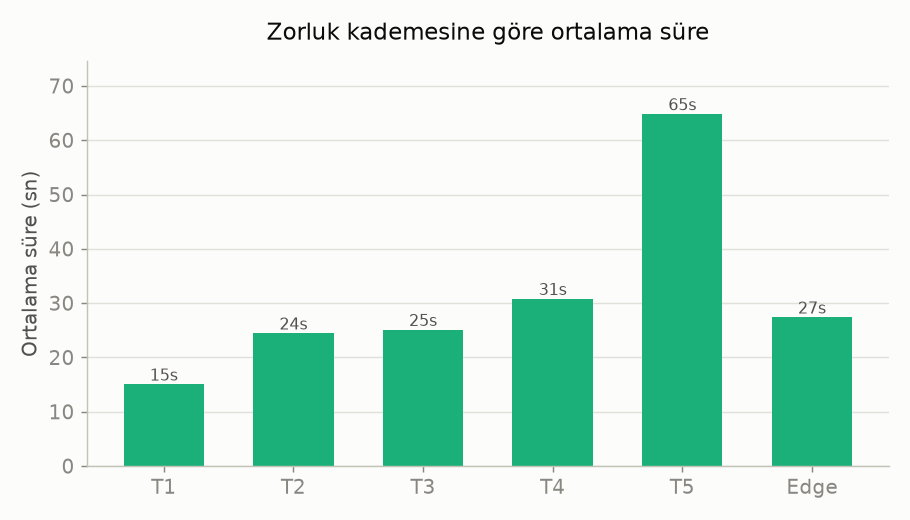
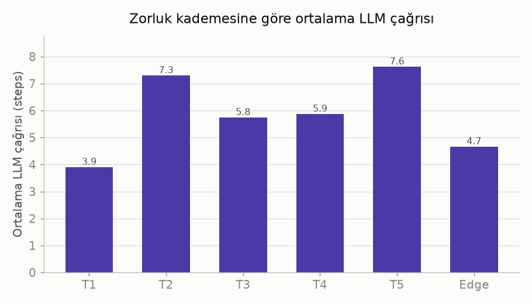
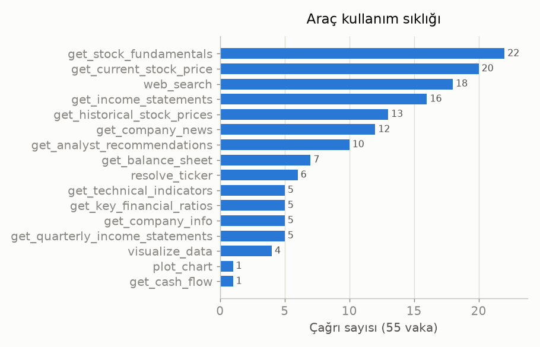

# Plan-and-Execute — `tes8` Koşusu Analizi

**Veri seti:** `equity-research-agentic-eval` (55 finansal analiz sorusu) · **Model:** Qwen/Qwen3.5-122B-A10B (HF Router / deepinfra) · **Mimari:** Plan-and-Execute

> **Tek cümle:** Plan-and-Execute ajanı 55 sorunun **54'ünü başarıyla** yanıtladı (**%98**); tek hata en zor kademedeki (T5) kapsamlı bir rapor sorusunda oluştu.

---

## Genel özet

| Metrik | Değer |
|--------|------:|
| Toplam soru | 55 |
| Başarılı | **54 (%98)** |
| Ortalama LLM çağrısı (steps) | 5.84 |
| Ortalama araç çağrısı | 2.73 |
| Ortalama token | 14.184 |
| Ortalama süre | 29.8 sn |
| Toplam token | 780.134 |
| Toplam süre | 27.3 dk |
| Yeniden planlama (replan) yapılan vaka | 17 / 55 |
| Doğrudan cevap — triyaj bypass (plansız) | 3 / 55 |

---

## Öne çıkan bulgular

- **Yüksek başarı (%98):** 6 zorluk kademesinin 5'i (T1–T4 + Edge) **%100** başarılı; yalnızca en karmaşık kademe T5'te 1 hata var.
- **Maliyet zorlukla ölçekleniyor:** Token ve süre, kademe zorlaştıkça belirgin artıyor — T1 ~7.9k token / 15 sn iken T5 ~22.2k token / 65 sn. Bu, çok adımlı sentez görevlerinin doğal yükü.
- **Uyarlanabilirlik çalışıyor:** 55 vakanın **17'sinde** replanner planı revize etti (plan-execute'un asıl gücü).
- **Triyaj bypass isabetli:** 3 vaka araç kullanmadan doğrudan yanıtlandı — 2'si kapsam-dışı Edge sorusu (E.3, E.6), 1'i şirket profili (1.2). Yani gereksiz araç çağrısı harcanmadı.
- **Araç kullanımı alana uygun:** En çok `get_stock_fundamentals`, `get_current_stock_price`, `web_search`, `get_income_statements` — bir hisse analizi ajanından beklenen dağılım.

---

## 1) Zorluk kademesine göre başarı

T1–T4 ve Edge tam başarılı; tek eksik T5'te (7/8).

| Kademe | Vaka | Başarı | Ort. token | Ort. süre | Ort. LLM çağrısı | Ort. araç |
|--------|-----:|-------:|-----------:|----------:|-----------------:|----------:|
| T1 | 11 | 11/11 | 7.944 | 15.0 sn | 3.9 | 1.2 |
| T2 | 10 | 10/10 | 16.612 | 24.4 sn | 7.3 | 3.0 |
| T3 | 12 | 12/12 | 13.651 | 25.1 sn | 5.8 | 2.4 |
| T4 | 8 | 8/8 | 14.675 | 30.8 sn | 5.9 | 3.5 |
| T5 | 8 | **7/8** | 22.198 | 64.8 sn | 7.6 | 5.0 |
| Edge | 6 | 6/6 | 11.305 | 27.4 sn | 4.7 | 1.7 |

---

## 2) Maliyet: token ve süre

T5 (kapsamlı yatırım raporları) hem en çok token'ı hem en uzun süreyi tüketiyor — 5+ araç çağrısı ve çok kaynaklı sentez gerektirdiği için. Basit tekil-araç soruları (T1) en ucuz ve en hızlı.

---

## 3) İş yükü: LLM çağrısı sayısı

Steps = planner + executor turları + replanner. T2 ve T5 en yüksek çağrı sayısına sahip (çok araçlı / yeniden planlamalı vakalar).

---

## 4) Araç kullanım sıklığı

Temel veri, fiyat, web araması ve gelir tablosu araçları başı çekiyor. Yeni eklenen `visualize_data` 4 görselleştirme vakasında kullanıldı.

---

## Tek başarısızlık — vaka 5.1

- **Soru:** "Koç Holding için kapsamlı bir temel analiz raporu…" (T5, `comprehensive_report`)
- **Durum:** `error`
- **Muhtemel neden:** En ağır kademedeki bu çok adımlı görev, sağlayıcı gecikmesi/askısı ya da uzun rapor çıktısının sınırı zorlaması. Bu koşudan sonra eklenen **çağrı timeout + retry** ile bu tür askıların koşuyu bloklamadan `error` işaretlenip devam etmesi sağlandı; yeniden koşuda büyük olasılıkla toparlanır.

---

## Sunum için çıkarımlar

- **Başlık mesajı:** Plan-and-Execute, gerçek dünya finans sorularında **%98 başarı** ile sağlam çalışıyor.
- **Anlatı:** Maliyet (token/süre) görev karmaşıklığıyla öngörülebilir biçimde ölçekleniyor; triyaj bypass basit/kapsam-dışı sorularda israfı önlüyor; replanner uyarlanabilirliği 17 vakada devrede.
- **Karşılaştırma notu:** Bu rapor yalnızca **Plan-Execute** tarafıdır. ReAct tarafını aynı `tes8` etiketiyle koşup aynı metrikleri (başarı, steps, token, süre) yan yana koyunca asıl "mimari karşılaştırması" tamamlanır — sunumun sonuç slaytları için ideal.
